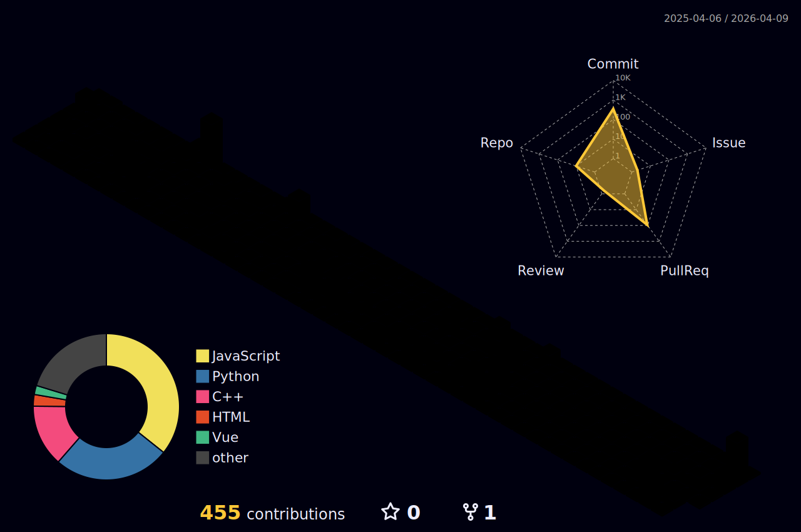

Computer Science @ Jeju National University

# ✉️ Contact
&nbsp;&nbsp;&nbsp;&nbsp;&nbsp;

# 🖋️ Blog
&nbsp;

# 💼 Experience
* Executive Organizer @ LIKELION JNU 14th `Feb 2026 - Present`
    * Managing tech seminars and hackathons for the Jeju National University chapter.
* Undergraduate Researcher @ Intelligent Computing Lab `Mar 2025 - Feb 2026`
    * Conducted research on NLP and LLM architectures.
* Sergeant (E-5) / Squad Leader @ Republic of Korea Army `Sep 2023 - Mar 2025`
    * Served as an Information System Operator (MOS 175.103) at the Battle Command Training Program (BCTP).
    * Operated Combat Service Support (CSS) simulation systems to support logistics and sustainability for high-level command post exercises.

# 🏆 Honors & Awards
| Date | Title / Event | Achievement | Field | Type |
| :--- | :--- | :--- | :--- | :--- |
| `Feb 26, 2026` | ICAIIC 2026 (Tokyo, Japan) | 📄 Poster Presentation | NLP, T5 Modeling | Conf. | 
| `Dec 18, 2025` | 한국데이터사이언스학회 동계종합학술대회 | 🎖️ Honorable Mention | ML, LLM | Conf. | 
| `Dec  4, 2025` | RISE Capstone Design Result-Presentation | 🥈 Excellence Prize | NLP, T5 Modeling | Comp. | 
| `Aug 19, 2025` | In-Jeju Challenge | 🥇 Grand Prize | Infra, BE | Comp. |

# 🛠️ Skills
### 🖥 Frontend
&nbsp;&nbsp;&nbsp;

### ⚙️ Backend
&nbsp;&nbsp;&nbsp;

### 🧠 AI & Machine Learning

### 🐋 DevOps & Infrastructure
&nbsp;

# 🏙️ Stats

